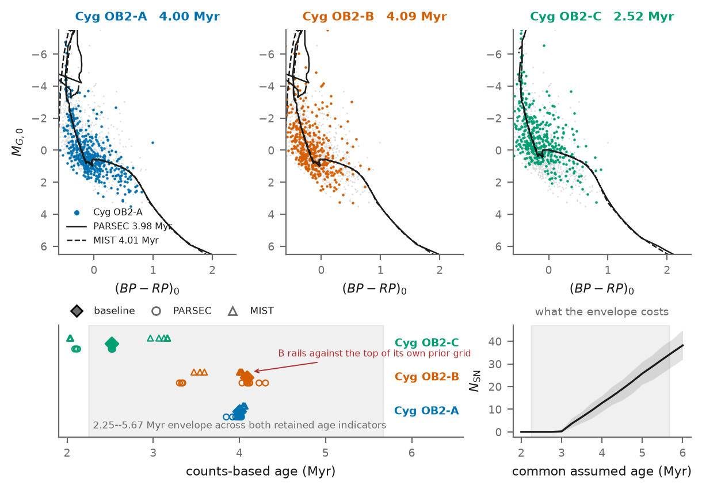

# Tracing the Massive-Star and Supernova History of Cygnus OB2

**Group-meeting briefing — 30 September 2026**

## The project in one sentence

I used Gaia DR3 and supporting photometry and spectroscopy to separate Cygnus OB2 into stellar subgroups, infer their ages and population sizes, and reconstruct a **model-dependent history of massive-star deaths**. The analysis is largely complete, but one final comparison is needed to prove that resolving the subgroups adds scientific value beyond a simpler one-age calculation.

---

## 1. Build a clean stellar census

### What I did

- Combined Gaia DR3 astrometry and photometry with 2MASS and published spectroscopy.
- Selected likely Cygnus OB2 members probabilistically rather than using a single hard cut.
- Separated the association into three stable kinematic groups: A, B and C.

### Outcome

The association is not one homogeneous cluster. The three groups overlap on the sky but differ in their motions and later turn out to have different ages.

---

## 2. Correct extinction and measure the subgroup ages

### What I did

- Estimated extinction for individual stars using spectroscopic reference stars and the spatial variation across the field.
- Compared the corrected colour–magnitude diagrams with PARSEC and MIST stellar-evolution models.
- Carried alternative extinction laws and stellar models instead of selecting only the most convenient result.

### Outcome

| Group | Baseline age |
|---|---:|
| A | 4.00 million years |
| B | 4.09 million years |
| C | 2.52 million years |

The central result is therefore **two older groups and one younger group**. However, the full age envelope is much wider, approximately 2.25–5.67 million years. Group B reaches the edge of its fitted age grid, and the age of C depends strongly on the adopted stellar models.

---

## 3. Estimate how many stars were originally formed

### What I did

- Measured the stellar mass distribution in the approximately complete 2–8 solar-mass interval.
- Used it to normalize the initial mass function for each subgroup.
- Checked the prediction against the observed stars above 8 solar masses, which were not used for normalization.

### Outcome

- The association as a whole is close to a standard Salpeter-like mass function.
- The subgroups are not identical: their preferred slopes are approximately 2.34 for A, 2.25 for B and 2.06 for C.
- The baseline model passes the mass-distribution checks in all three groups.
- Across the full model grid, 40 of 54 individual fits pass; only 15 of 36 headline branches pass in all three groups. This limitation must remain visible.

---

## 4. Reconstruct the stellar-death history

### What I did

- Drew many possible stellar populations consistent with the measured ages and population normalizations.
- Used stellar lifetimes to determine which simulated stars should already be dead and when they died.
- Repeated the calculation for different stellar models, extinction laws, mass-function slopes and star-formation durations.

### Baseline outcome

These numbers assume that every relevant massive-star death produces a successful supernova:

| Group | Expected deaths |
|---|---:|
| A | 4.17 |
| B | 4.26 |
| C | 0.00 |
| **Total** | **8.43** |

- Median total: 8 deaths, with a 68% stochastic interval of 5–11.
- Full headline model range: approximately 5.6–28.7 deaths.
- Probability of an event within the last 100,000 years: 0.552 on the baseline, with a branch range of approximately 0.411–0.889.
- The baseline history begins about 1.3 million years ago and is supplied by A and B; C contributes nothing on this branch.

The spread between model assumptions is larger than the random sampling uncertainty within one model. The dominant problem is therefore not Monte Carlo noise; it is uncertainty in age, stellar evolution and the high-mass population.

---

## 5. Separate stellar deaths from successful explosions

A stellar death in the population model is not automatically an observable supernova. Very massive stars may collapse quietly into black holes, and binary evolution can alter both masses and lifetimes.

The analysis therefore tested simple direct-collapse thresholds. Under a hard threshold at or below 30 solar masses, the model returns zero successful explosions. This is a **sensitivity test**, not a physical prediction that every star above 30 solar masses fails.

The result that only very massive stars could already have died is expected for such a young population. The exact lower mass boundaries are useful bookkeeping, but they are not a new discovery.

---

## 6. What earlier studies had already done

- **Wright et al. (2015):** measured the massive-star population and mass of Cygnus OB2 and already argued that the association may have experienced a supernova.
- **Berlanas et al. (2019, 2020):** demonstrated distance structure and multiple star-formation episodes.
- **Knödlseder et al. (2002) and Martin et al. (2010):** modelled age-dependent massive-star feedback and supernova activity in the Cygnus region.
- **Fuchs et al. (2006):** used the same basic missing-high-mass-star logic for other associations.
- **Menchiari et al. (2024):** simulated Cygnus OB2 populations and predicted `7 ± 2.5` supernovae at 3 million years and `26 ± 5` at 5 million years.
- **Sukhbold, Ertl and collaborators:** had already established that stellar death and successful explosion are not equivalent.

Therefore, the novelty is **not** simply predicting several deaths, showing age sensitivity, or noting that young populations lose only their most massive stars.

---

## 7. The strongest possible new result

The promising question is whether treating Cygnus OB2 as one population gives a biased history.

The current diagnostic gives:

| Treatment | Expected deaths | Probability of an event within 100,000 years |
|---|---:|---:|
| All groups forced to an age of 4 million years | 12.73 | 0.727 |
| Groups given their separately inferred ages | 8.43 | 0.552 |

The common-age calculation is 4.30 deaths, or 51%, higher. Almost all of the difference comes from treating young group C as if it were as old as A and B.

This is promising but **not yet decisive**. Four million years was imposed rather than obtained from the best possible one-population fit. A fair pooled model could infer another age and reproduce the resolved total.

The defensible potential contribution is:

> Near the first-supernova boundary, averaging together populations of different ages may bias both the inferred number and timing of stellar deaths. A subgroup-resolved analysis can identify when the simple one-age approximation fails.

---

## 8. Why the paper is not ready yet

The analysis pipeline and manuscript build are complete, but the central novelty test is missing. The current manuscript also predates the novelty audit and still gives too much prominence to some already-known results.

Other limitations that must be stated clearly:

- the result is a conditional stellar-death history, not an observed list of supernovae;
- the age of group C is strongly model dependent;
- several mass-function branches fail their fit-quality checks;
- the direct-collapse prescription is deliberately simple;
- binary evolution is not modelled;
- the formal convergence criterion failed, although the practically important results changed only slightly;
- the high-energy interpretation remains a conditional application, not a confirmed origin of the Cygnus gamma-ray emission.

Administrative work also remains: confirm co-authors and affiliations, archive the large data products, refresh the literature search and cleanly preserve the present uncommitted revision.

---

## 9. Next steps

### Essential scientific test

1. Reproduce the simple Menchiari-style calculation under matched assumptions.
2. Fit the same Gaia-selected stars as **one pooled population**, obtaining its age and population normalization from the data.
3. Compare that pooled model with the existing three-subgroup model while keeping every other assumption fixed.
4. Compare predictive fit, total deaths, event timing and recent-event probability.
5. Test both methods on simulated coeval and multi-age populations to determine whether subgroup resolution reduces bias without inventing false structure.

### Decision after the test

- **If subgroup resolution is preferred and materially changes the history:** use this as the paper's main result.
- **If it improves the stellar fit but not the death history:** focus the paper on the resolved stellar population; present the death history as an application.
- **If the pooled and resolved models are equivalent:** report that the simple estimator is adequate and map the conditions under which that conclusion holds.

### Final publication work

- Rewrite the abstract, results and conclusions around the outcome of this comparison.
- Replace claims of an observed "supernova history" with explicitly conditional language.
- Update the figures and group-meeting slides.
- Repeat the literature search immediately before submission.
- Confirm the author list, affiliations, data archive and code-release plan.

---

## Suggested presentation structure

| Slide | Main message | Visual |
|---|---|---|
| 1 | Scientific question: how many massive stars have died, and when? | Title plus a simple project diagram |
| 2 | Gaia separates Cygnus OB2 into three populations | Membership/subgroup plot |
| 3 | The populations do not have the same age | Age and colour–magnitude plot |
| 4 | The present-day census constrains the original high-mass population | Mass-function closure plot |
| 5 | Baseline result: about 8 possible deaths, but a large model range | Death-history plot and result table |
| 6 | Age and explosion physics dominate the uncertainty | Sensitivity plot |
| 7 | Scientific concern: earlier work already predicted similar counts | Very short prior-art comparison |
| 8 | Candidate novelty: one-age versus subgroup-resolved history | `12.73 versus 8.43` comparison |
| 9 | Missing decisive test and immediate work plan | Pooled model → subgroup model → decision |

## Closing message for the meeting

> The work has produced a complete Gaia-based, subgroup-resolved stellar-death reconstruction. The baseline predicts about eight possible deaths, but the result is dominated by age and stellar-model assumptions. Earlier studies already established the basic count and its age sensitivity. The remaining publication question is whether resolving the association into populations gives a demonstrably better and materially different history than the best one-population analysis. That controlled comparison is the next essential step.
