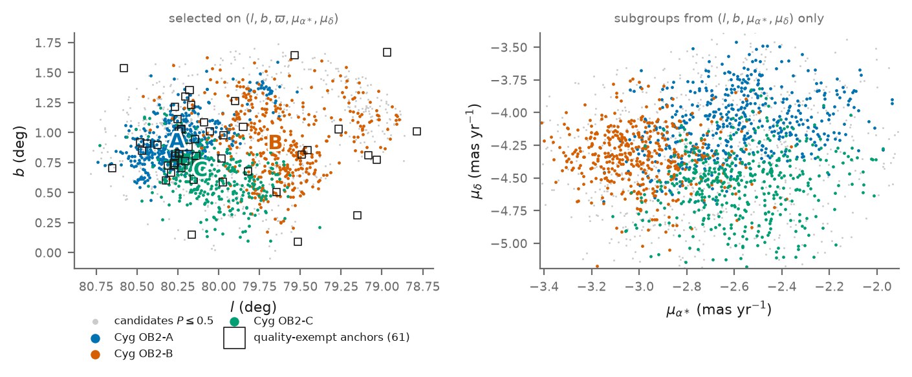
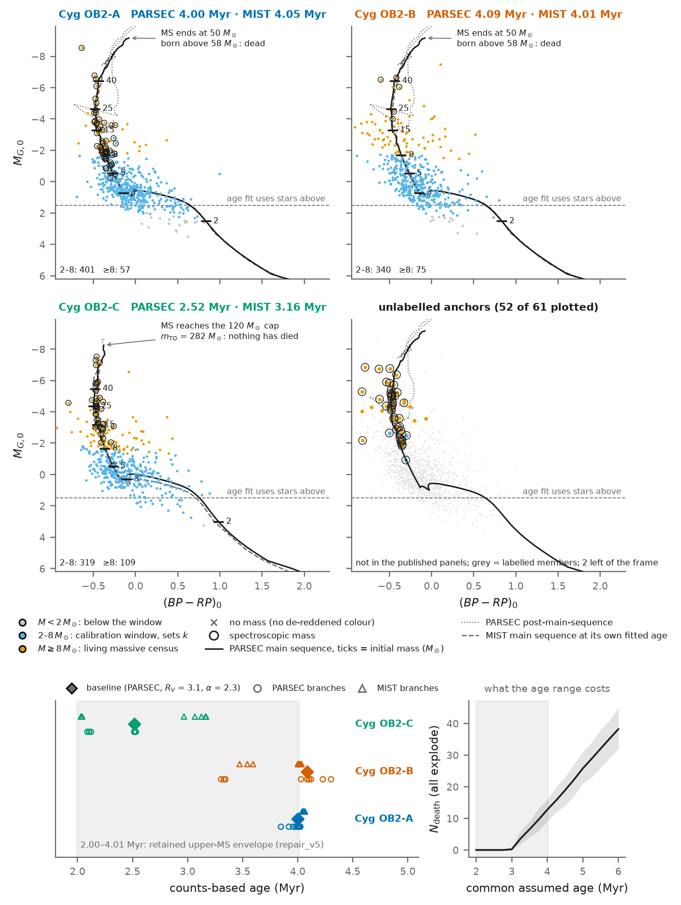
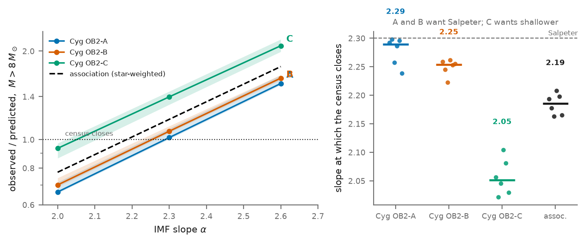
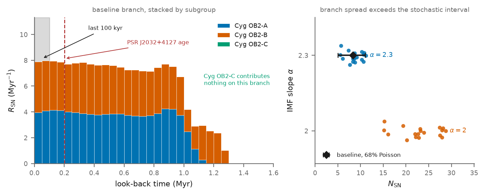
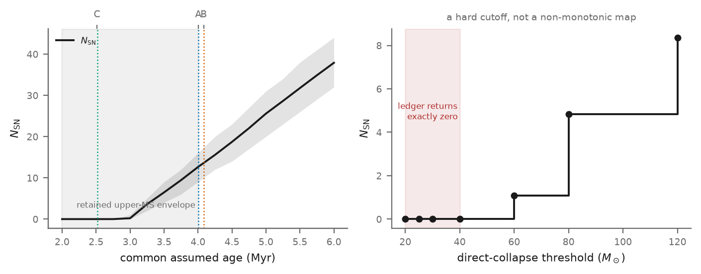

# Tracing the Massive-Star and Supernova History of Cygnus OB2

**Group-meeting briefing — 30 September 2026**

## The project in one sentence

I used Gaia DR3 and supporting photometry and spectroscopy to separate Cygnus OB2 into stellar subgroups, infer their ages and population sizes, and reconstruct a **model-dependent history of massive-star deaths**. The analysis is largely complete, but one final comparison is needed to prove that resolving the subgroups adds scientific value beyond a simpler one-age calculation.

---

## Physics primer: the chain of equations

Everything below rests on six relations. A note on notation: the figures label the death count $N_{\rm SN}$. Everywhere in this document that means $N_{\rm death}$, i.e. $N_{\rm SN}\,|\,\text{all explode}$: it is **not** an observed supernova count.

**(1) Initial mass function (IMF).** The number of stars born per unit of birth mass:

$$
\xi(m) \equiv \frac{dN}{dm} = k\, m^{-\alpha}
$$

- $m$ is the birth mass in $M_\odot$.
- $\alpha$ is the slope; a larger $\alpha$ means fewer massive stars per light star.
- $k$ is the normalisation, i.e. the size of the star-formation event. It is the one number fitted per subgroup.

**Salpeter.** Salpeter (1955) measured $\alpha = 2.35$ for stars of about $0.4$–$10\,M_\odot$ in the solar neighbourhood. Kroupa (2001) gives $\alpha \approx 2.3$ above $0.5\,M_\odot$, with a shallower slope below. "Salpeter-like" in this project means $\alpha \approx 2.3$, the baseline value.

**(2) Normalising in the 2–8 $M_\odot$ window.** Stars in this range meet two conditions:
- none has died yet, since an $8\,M_\odot$ star lives about 40 Myr;
- Gaia plus 2MASS detect nearly all of them.

So the count there is the birth count:

$$
N_{\rm obs}(2\text{–}8\,M_\odot) \simeq k \int_{2}^{8} m^{-\alpha}\, R(\mathrm{obs}\mid m)\, dm
$$

$R(\mathrm{obs}\mid m)$ is the completeness, the probability that a star of mass $m$ enters the catalogue. $k$ is fitted with a Poisson likelihood.

**(3) Lifetime and turnoff mass.** Luminosity grows as $L \propto m^{3.5}$ and fuel as $m$, so

$$
\tau(m) \propto \frac{m}{L} \propto m^{-2.5}.
$$

The turnoff mass $m_{\rm TO}(t)$ is defined by $\tau(m_{\rm TO}) = t$. Every star born heavier than $m_{\rm TO}$ is already dead.

**(4) Death count.**

$$
N_{\rm death}(t) = k \int_{m_{\rm TO}(t)}^{m_{\max}} m^{-\alpha}\, dm, \qquad m_{\max} = 120\,M_\odot
$$

This is zero whenever $m_{\rm TO} > 120\,M_\odot$. That is group C's situation: at 2.52 Myr its turnoff is about $279\,M_\odot$.

**(5) Death history: mass is a clock.** For a coeval group of age $t$, a star of mass $m$ died at look-back time $t_{\rm lb} = t - \tau(m)$. Changing variables from mass to time gives the rate:

$$
R_{\rm SN}(t_{\rm lb}) = \xi(m)\left|\frac{dm}{d\tau}\right|_{\tau(m)\,=\,t - t_{\rm lb}},
\qquad
\int_0^{t} R_{\rm SN}\, dt_{\rm lb} = N_{\rm death}
$$

The first death came at $t_{\rm lb} = t - \tau(m_{\max})$. On the project's PARSEC relation $\tau(120\,M_\odot) \approx 3.0$ Myr. That gives about 1.0 Myr ago for A ($t \approx 4.0$ Myr) and about 1.3 Myr ago for B, whose age draws reach 4.26 Myr.

**(6) Why deaths are a Poisson process, and the probabilities it gives.** Given a star's mass and the group's age, its death is not random. The randomness is in how many massive stars were born and at which masses.
- Tens of thousands of stars each had a tiny, independent chance of landing above the turnoff. That is the law of rare events (a binomial with large $n$ and small $p$), so the count in any mass interval is Poisson with mean $k\int m^{-\alpha}dm$.
- Death time is a one-to-one function of mass. A Poisson scatter of points in mass therefore becomes a Poisson scatter of points in time, with intensity $R_{\rm SN}(t_{\rm lb})$.
- Counts in disjoint time windows are independent, which gives:

$$
P(\ge 1\ \text{death}) = 1 - e^{-N_{\rm death}} \approx 0.9998 \quad (N = 8.43)
$$

$$
P(\text{last death} < 100\ \text{kyr}) = 1 - \exp\!\left[-\int_0^{0.1\,\rm Myr} R_{\rm SN}\,dt_{\rm lb}\right] \approx 1 - e^{-8 \times 0.1} \approx 0.55
$$

$$
\text{68\% stochastic interval} \approx N \pm \sqrt{N} = 8.4 \pm 2.9 \;\Rightarrow\; 5\text{–}11
$$

This is how the Monte Carlo in `scripts/wp7_ledger.py` works:
1. Draw a paired $(k,\,t)$ from the fitted posterior.
2. Draw $N \sim \mathrm{Poisson}\!\left(k\int_{m_{\rm TO,min}}^{120} m^{-\alpha}dm\right)$.
3. Draw $N$ masses from the IMF.
4. Mark each star dead or alive, and date each death.

Because $k$ and $t$ are themselves uncertain, the result is a slightly wider "mixed Poisson". The assumption can break in three ways:
- **Fixed mass budget.** If a cloud forms stars until its gas runs out, the counts are slightly less scattered than Poisson.
- **"Optimal sampling".** Weidner & Kroupa argue that a cluster's maximum stellar mass is set by its own mass, which removes most of the randomness. This is debated.
- **Binaries.** Companion masses are correlated, and stars can merge.

### The model grid: "model family", branches, and 36 vs 54

**Model family** means the stellar-evolution model set used for the isochrones, the lifetimes and the turnoff:
- **PARSEC** (Padova–Trieste; Bressan et al. 2012);
- **MIST** (built on the MESA code; Choi et al. 2016).

They differ in convective overshoot, rotation (MIST includes it), mass loss, opacities and bolometric corrections. Switching family changes:
- the mass assigned to each star, from its CMD position;
- the fitted ages;
- the lifetime–mass relation $\tau(m)$, and hence $m_{\rm TO}$.

The two families disagree most for very massive and very young stars, which is exactly where group C sits.

Two different grids of 54 appear in this document:

| grid | axes | size |
|---|---|---:|
| mass-function fits (§3) | family (2) × $R_V$ (3) × $\alpha$ (3) × subgroup (3) | 54 fits; 40 pass |
| death-ledger branches (§4) | family (2) × $R_V$ (3) × $\alpha$ (3) × star-formation duration $\delta \in \{0, 1, 2\}$ Myr (3) | 54 branches |
| headline ledger set | as above but $\alpha \in \{2.0, 2.3\}$ | 36 branches |

- **The 15 of 36.** Of the 12 (family, $R_V$, $\alpha$) cells with $\alpha \in \{2.0, 2.3\}$, only 5 pass the mass-function check in all three subgroups; times three formation durations, that is 15.
- **Why $\alpha = 2.6$ was dropped from the headline.** The criterion was fixed in advance: the Poisson $\chi^2$ of the 2–8 $M_\odot$ calibration fit.
  - $\alpha = 2.6$ is the best fit in only 1 of 18 (family × $R_V$ × subgroup) cells.
  - It has the worst median $\chi^2$: 10.80, against 6.86 for $\alpha = 2.3$ and 10.30 for $\alpha = 2.0$.
- **The closure test was not used to choose.** The census closure above $8\,M_\odot$ (§3) independently agrees: $\alpha = 2.6$ wins 0 of 18. It was deliberately not used for the choice, so that it remains an independent validation of the extrapolation.
- **$\alpha = 2.6$ is still reported.** It gives $N = 1.93$–$4.24$ and appears in the sensitivity table.
- **Consequence of the choice.** Dropping it raises the branch-set median from 8.79 to 13.29 while the baseline stays at 8.43. So lead with the baseline and its range, and never quote an ensemble median.

---

## 1. Build a clean stellar census

### What I did

- Combined Gaia DR3 astrometry and photometry with 2MASS and published spectroscopy.
- Selected likely Cygnus OB2 members probabilistically rather than using a single hard cut.
- Separated the association into three stable kinematic groups: A, B and C.

### Outcome

The association is not one homogeneous cluster. The three groups overlap on the sky but differ in their motions and later turn out to have different ages.

### Reading the figure

**Left panel: position on the sky.**
- $l$ and $b$ are Galactic longitude and latitude. The $l$ axis increases to the **left**, the sky-map convention.
- **Grey dots** are candidates with membership probability $P \le 0.5$. $P$ is the probability that a star belongs to Cyg OB2 rather than the Galactic-disc foreground or background. Only stars with $P > 0.5$ count as members.
- **Coloured dots** are the members of subgroups A, B and C.
- The title "selected on $(l, b, \varpi, \mu_{\alpha*}, \mu_\delta)$" means membership used five quantities, including the parallax:

$$
\varpi\,[\mathrm{mas}] = \frac{1}{d\,[\mathrm{kpc}]} \;\Rightarrow\; \varpi \approx 0.62\ \mathrm{mas\ at}\ 1.62\ \mathrm{kpc}
$$

**Right panel: vector-point diagram.**
- $\mu_{\alpha*} \equiv \mu_\alpha \cos\delta$ and $\mu_\delta$ are the angular drift across the sky in RA and Dec, in mas/yr.
- Stars born from one cloud inherit its velocity, so they clump in this plane.
- The subgroups were found from position and proper motion **without** parallax. At 1.6 kpc the parallax errors exceed the association's depth, so parallax cannot separate groups.
- Angular motion converts to transverse velocity as

$$
v_t\,[\mathrm{km\,s^{-1}}] = 4.74\;\mu\,[\mathrm{mas\,yr^{-1}}]\; d\,[\mathrm{kpc}]
$$

  The group centres differ by about $0.3$–$0.5$ mas/yr, which is about 2–4 km/s: typical of distinct sub-clusters within an OB association. The common offset of about $(-2.7, -4.4)$ mas/yr is mostly Galactic rotation plus the Sun's own motion.

**Why the proper-motion panel is needed.** On the sky the groups overlap (C lies almost on top of A), so the left panel alone cannot show they are separate populations. The right panel shows different bulk velocities, i.e. different birth velocities from different parent-cloud fragments. The clustering worked in all four dimensions at once, so neither 2-D projection shows the full separation. The ages were measured later and turned out to differ as well, an independent check that the split is physical.

**Why A and B swap sides between the panels.** The proper-motion space is not inverted. Two conventions combine:
1. The $l$ axis is reversed, while the $\mu_{\alpha*}$ axis increases normally to the right.
2. The left panel is in Galactic coordinates and the right in equatorial, and at Cygnus the two frames are rotated relative to each other.

In Galactic proper-motion components (medians):

| | $l$ (deg) | $b$ (deg) | $\mu_{l*}$ (mas/yr) | $\mu_b$ (mas/yr) |
|---|---:|---:|---:|---:|
| A | 80.26 | 0.92 | −4.80 | −0.33 |
| B | 79.65 | 0.90 | −5.26 | −0.12 |
| C | 80.11 | 0.68 | −5.19 | −0.62 |

- B lies at lower $l$ than A and moves toward lower $l$ relative to A: $\Delta\mu_{l*} \approx -0.46$ mas/yr, about 3.5 km/s.
- C lies at lower $b$ and moves toward lower $b$.

In one consistent frame with both axes drawn the same way, B would sit on the same side in both panels. That each group is offset in the direction it moves away from A only hints at the groups drifting apart. It is a quick median comparison, not tested by the pipeline, and should not be quoted as a result.

**Open squares: the 61 quality-exempt anchors.** These are spectroscopically classified stars (O and early-B stars, supergiants, Wolf–Rayet stars), kept even though they fail the Gaia quality cuts. They are needed for two reasons.
1. **Extinction calibration.** A spectral type fixes the intrinsic colour, so observed minus intrinsic colour gives the reddening directly. The anchors are where the extinction is *measured*; everywhere else it is interpolated.
2. **Keeping the most massive stars in the census.** About 70% of O stars are in binaries. Binary motion inflates RUWE, Gaia's astrometric fit-quality statistic, above the 1.4 cut. Crowding and bright nebular emission inflate the BP/RP flux excess. A uniform cut would delete massive stars far more often than light ones, and missing massive stars would look like *dead* ones, inflating the death count and distorting the closure test.

  The anchors' membership comes from spectroscopy, not astrometry. The cost is that their proper motions are less reliable, so their subgroup labels are weaker. They are concentrated in the A/C core and sparse around B, which is why B's extinction calibration is the weakest.

---

## 2. Correct extinction and measure the subgroup ages

### What I did

- Estimated extinction for individual stars using spectroscopic reference stars and the spatial variation across the field.
- Compared the corrected colour–magnitude diagrams with PARSEC and MIST stellar-evolution models.
- Carried alternative extinction laws and stellar models instead of selecting only the most convenient result.

### Outcome

| Group | Baseline age |
|---|---:|
| A | 4.00 million years |
| B | 4.09 million years |
| C | 2.52 million years |

The central result is therefore **two older groups and one younger group**. However, the age envelope across all retained model branches is wider, **2.00–4.01 million years**, and it comes from the upper main sequence alone. *(Corrected 2026-10-01: the previously quoted 2.25–5.67 Myr came from a pre-repair run; see issue #19 in §8.)* Group B reaches the edge of its fitted age grid, and the age of C depends strongly on the adopted stellar models.

*Redesigned version of paper Figure 4, from `scripts/draft_fig04_cmd_redesign.py`. It replaces `figures/paper/fig04_cmd_ages.png`, which plotted a single black isochrone over plain dots, left out the 61 unlabelled anchors and shaded a stale 2.25–5.67 Myr band (issue #19). Not yet in the paper figure set.*

### Reading the figure

**Top four panels: de-reddened colour–magnitude diagram (CMD).** There is one panel per subgroup, and a fourth for the anchors that have no subgroup label. The axes are colour and absolute magnitude with dust and distance removed:

$$
(BP-RP)_0 = (BP-RP) - E(BP-RP), \qquad
M_{G,0} = G - A_G - \mu, \qquad
\mu = 5\log_{10}\!\frac{d}{10\ \mathrm{pc}} = 11.05\ \mathrm{mag}
$$

- $(BP-RP)_0$ is a temperature proxy; more negative means hotter.
- $M_{G,0}$ is plotted with the axis inverted, so brighter stars are higher.
- **Extinction.** $A_G$ is the dust dimming in the G band and $E$ is the reddening. Cygnus has $A_V \approx 4$–8 mag, varying star to star. The dust mixture enters through

$$
R_V = \frac{A_V}{E(B-V)} \in \{3.0,\ 3.1,\ 3.5\},
$$

  carried as three parallel branches. The panels show the baseline, $R_V = 3.1$.

**What is drawn on the dots** is what the analysis takes from the diagram:
- **Dot colour is the star's mass class**, read from the isochrone (or from spectroscopy for ringed stars) on the baseline branch:
  - grey: below $2\,M_\odot$;
  - blue: the $2$–$8\,M_\odot$ window that fixes the normalisation $k$;
  - orange: at least $8\,M_\odot$, the living census that the closure test compares with the IMF prediction.

  The counts are printed in each panel: A 401 / 57, B 340 / 75, C 319 / 109.
- **Ringed stars** have spectroscopic masses. Their spectroscopic temperature breaks the hot-star colour degeneracy.
- **The black curve** is the PARSEC isochrone at the subgroup's baseline age, drawn as a **mass ruler**: tick marks give initial mass in $M_\odot$. The solid part is the main sequence; the dotted part is the brief post-main-sequence phases. The label at the top gives where the main sequence ends and the **turnoff mass**, above which every star born is already dead:
  - A and B: the main sequence ends at about $50\,M_\odot$, and everything born above $58\,M_\odot$ has died.
  - C: the main sequence still reaches the $120\,M_\odot$ cap, so nothing has died. That is why C contributes zero deaths.
- **The grey dashed curve** is the MIST main sequence at MIST's own fitted age (A 4.05, B 4.01, C 3.16 Myr).
- **The dashed horizontal line** at $M_{G,0} = +1.5$ is the magnitude cut of the age fit: only stars above it are used.

**Only one clock is used.** A CMD carries two clocks:
1. **The upper main sequence.** This is the near-vertical band at $(BP-RP)_0 \approx -0.3$ to $-0.5$; its top shows which masses are still alive.
2. **The pre-main-sequence turn-on.** This is the kink near $M_{G,0} \approx +0.5$, below which stars of about $2$–$3\,M_\odot$ are still contracting toward the main sequence.

At 1.62 kpc and $A_V \approx 4$–8, too few faint stars are detected (15, 4 and 3 in A, B and C), so every pre-main-sequence age fails its minimum-star-count check. **All ages in the current chain are upper-main-sequence ages.**

**What the panels show:**
1. **C's four brightest stars** ($M_{G,0}$ from $-7.0$ to $-7.5$) sit on PARSEC's main sequence, which reaches $\approx -8.3$ at 2.5 Myr. MIST's main sequence is never brighter than about $-6.8$ between 2 and 3.6 Myr, so MIST needs an older age (≈3.2 Myr). This is why the two families disagree about C.
2. **In B, dozens of stars above $8\,M_\odot$ sit bluer than any model allows.** This points to over-corrected extinction, consistent with B having only 5 spectroscopic stars. It needs checking, because it would inflate B's census above $8\,M_\odot$.
3. **A has one star at $M_{G,0} \approx -8.5$**, above the end of its main sequence: an evolved star or an unresolved multiple.
4. **The 61 unlabelled anchors** (52 have photometry) are mostly above $8\,M_\odot$: the most massive members of the association. Two lie at unphysically blue colours, left of the frame.

Caveat: some ringed masses are affected by issue #19. On PARSEC branches, 8 anchors in A are in the wrong mass class.

**Why the isochrone wiggles at the bright, hot end.** On the 4 Myr PARSEC isochrone, a narrow range of birth masses traces the whole post-main-sequence life:

| birth mass ($M_\odot$) | current mass | $T_{\rm eff}$ (K) | $\log L/L_\odot$ | $(BP-RP)_0$ | $M_{G,0}$ | phase |
|---:|---:|---:|---:|---:|---:|---|
| 40 | 36.7 | 31,000 | 5.58 | −0.44 | −6.4 | main sequence |
| 50.1 | 35.4 | 12,000 | 5.79 | −0.11 | −9.1 | end of main sequence, cooling |
| 51.0 | 33.2 | 18,800 | 5.80 | −0.28 | −8.1 | "hook": contracts and heats briefly |
| 53.8 | 31.1 | 5,900 | 5.97 | +0.76 | −10.3 | crosses to a yellow/red supergiant |
| 54.3 | 27.3 | 59,000 | 6.00 | −0.25 | −6.2 | winds strip the envelope |
| 64 | 21.2 | ~200,000 | 5.9 | −0.3 | −3.3 | Wolf–Rayet-like stripped core |

Three effects produce the tangle:
1. **Evolution after the main sequence is fast.** An isochrone is a snapshot, so stars a few per cent heavier are caught at later stages.
2. **Luminosity stays nearly constant; only temperature changes.** On the Gaia CMD this is distorted by the bolometric correction, $M_G = M_{\rm bol} - BC_G(T_{\rm eff})$:
   - at about 6,000 K the light peaks in the optical, so $M_G$ brightens to about $-10$;
   - at 100,000 K or more nearly all of the light is in the far ultraviolet, so $M_G$ fades to about $-3$ while $L$ is unchanged.

   The "fading" lines are hot stars getting *hotter*, not dimmer.
3. **Optical colour saturates for hot stars.** Gaia sees only the long-wavelength (Rayleigh–Jeans) tail of stars hotter than about 20,000 K, so $BP-RP$ sticks near $-0.3$ to $-0.5$ between 25,000 and 200,000 K. That is why the upper main sequence is vertical.

The supergiant loop at $M_{G,0} \approx -10$ still runs off the top of the frame. No observed member is there.

**Bottom-left: the age for every model branch.**
- **The y-axis has no numerical meaning.** It is a one-dimensional dot plot of age, split into three rows: A at the bottom, B in the middle, C at the top.
- Within each row, PARSEC circles are nudged slightly below the row line and MIST triangles slightly above. The filled diamond is the baseline (PARSEC, $R_V = 3.1$, $\alpha = 2.3$). Each family has 9 markers per subgroup, one per $R_V \times \alpha$ combination; many overlap.
- **The x-axis ("counts-based age")** is the colour–magnitude age posterior reweighted by how well each age also reproduces the 2–8 $M_\odot$ counts (a joint fit of age and normalisation). This is why $\alpha$ shifts the age slightly.
- **The shaded band (2.00–4.01 Myr)** is the span of the best-fit colour–magnitude ages across all retained branches, computed from the posteriors the chain uses. Some counts-based ages fall outside it: B's PARSEC points reach 4.23 Myr, because the counts-based fit samples B's whole age posterior, which extends to about 4.6 Myr.
- **How to read the spread:**
  - **A** agrees across all branches (3.9–4.1 Myr). At about 4 Myr both model families give nearly the same turnoff (58.3 vs 58.6 $M_\odot$).
  - **B's** low cluster (3.3–3.5 Myr) is the $R_V = 3.5$ branch of *both* families. Higher $R_V$ makes every star about 0.29 mag brighter, which needs a younger isochrone. At $R_V = 3.0$ and 3.1 the families agree near 4.0–4.2 Myr. B's posterior also piles up at the top of its allowed grid, so its age is a lower bound.
  - **C** splits by family (PARSEC 2.5, MIST 3.1 Myr; see point 1 above), and $R_V = 3.5$ pulls both down to 2.0–2.1 Myr.

**Bottom-right: the death count against a common assumed age.**
- All three subgroups are forced to one age, with everything else at baseline. The line is the mean; the band is the 16–84% range of the Monte Carlo draws. The shaded strip is the same retained age envelope.
- The count is exactly 0 below about 2.75 Myr, because $m_{\rm TO}$ is still above $120\,M_\odot$.
- Above about 3.25 Myr it grows at roughly 12 deaths per Myr of age, reaching 12.7 at 4.0 Myr and 38.2 at 6.0 Myr. The slope is

$$
\frac{dN_{\rm death}}{dt} = \xi(m_{\rm TO})\left|\frac{dm_{\rm TO}}{dt}\right|:
$$

  each extra Myr moves the turnoff down into a more heavily populated part of the IMF.

---

## 3. Estimate how many stars were originally formed

### What I did

- Measured the stellar mass distribution in the approximately complete 2–8 solar-mass interval.
- Used it to normalize the initial mass function for each subgroup.
- Checked the prediction against the observed stars above 8 solar masses, which were not used for normalization.

### Outcome

- The association as a whole is close to a standard Salpeter-like mass function.
- The subgroups are not identical: their preferred slopes are approximately 2.34 for A, 2.25 for B and 2.06 for C. *(A's value is expected to move lower once issue #19 is fixed; see §8.)*
- The baseline model passes the mass-distribution checks in all three groups.
- Across the full model grid, 40 of 54 individual fits pass; only 15 of 36 headline branches pass in all three groups. This limitation must remain visible.

### Reading the figure

This test decides whether the IMF extrapolation above $8\,M_\odot$ can be trusted. The normalisation $k$ is fitted on 2–8 $M_\odot$ stars. It then predicts how many **living** stars should exist between $8\,M_\odot$ and the turnoff, and the prediction is compared with the number observed:

$$
\mathcal{C}(\alpha) = \frac{N_{\rm obs}(8\,M_\odot \rightarrow m_{\rm TO})}{k(\alpha)\displaystyle\int_{8}^{m_{\rm TO}} m^{-\alpha}\, R(\mathrm{obs}\mid m)\, dm}
$$

**Left panel.**
- **x-axis:** the assumed IMF slope $\alpha$.
- **y-axis (log scale):** $\mathcal{C}$. At $\mathcal{C} = 1$ (dotted, "census closes") the extrapolation works.
- **Why every line rises with $\alpha$.** A steeper IMF, fitted to the same 2–8 $M_\odot$ count, predicts fewer massive stars, so the denominator shrinks.
- **Lines** are medians and **shaded bands** the min–max range over the six family × $R_V$ cells. "Model family" (PARSEC vs MIST) changes the stellar masses read off the CMD, the ages and the turnoff, which moves both the numerator and the denominator.
- **Dashed line:** the whole association, each group weighted by its number of stars.

**Right panel.**
- Each dot is the slope at which $\mathcal{C} = 1$ for one family × $R_V$ cell. The bar is the median.
- A needs 2.34 and B needs 2.25, both near the dashed $\alpha = 2.3$ reference line.
- C needs **2.06**: it has more observed massive stars than a standard IMF predicts from its 2–8 $M_\odot$ count. At $\alpha = 2.3$, C's ratio is about 1.4. The possible causes are:
  - a genuinely different IMF;
  - an error in C's age or mass scale;
  - incompleteness in C's 2–8 $M_\odot$ count.

  This figure cannot tell them apart.

**Why the slope matters so much.** With the same 2–8 $M_\odot$ normalisation, the number of stars born above the baseline turnoff (about $52\,M_\odot$) scales as

$$
\frac{N(52\text{–}120)}{N(2\text{–}8)} = \frac{52^{\,1-\alpha} - 120^{\,1-\alpha}}{2^{\,1-\alpha} - 8^{\,1-\alpha}}
\approx
\begin{cases}
0.029 & \alpha = 2.0\\
0.011 & \alpha = 2.3\\
0.0045 & \alpha = 2.6
\end{cases}
$$

That is about $\times 2.5$ from $\alpha = 2.3$ to $2.0$ and about $\times 0.4$ from $2.3$ to $2.6$, which is why $\alpha$ moves the death count by a factor of five across the grid.

---

## 4. Reconstruct the stellar-death history

### What I did

- Drew many possible stellar populations consistent with the measured ages and population normalizations.
- Used stellar lifetimes to determine which simulated stars should already be dead and when they died.
- Repeated the calculation for different stellar models, extinction laws, mass-function slopes and star-formation durations.

### Baseline outcome

These numbers assume that every relevant massive-star death produces a successful supernova:

| Group | Expected deaths |
|---|---:|
| A | 4.17 |
| B | 4.26 |
| C | 0.00 |
| **Total** | **8.43** |

- Median total: 8 deaths, with a 68% stochastic interval of 5–11.
- Full headline model range: approximately 5.6–28.7 deaths.
- Probability of an event within the last 100,000 years: 0.552 on the baseline, with a branch range of approximately 0.411–0.889.
- The baseline history begins about 1.3 million years ago and is supplied by A and B; C contributes nothing on this branch.

### Reading the figure

**Left panel: death rate against time.**
- **x-axis:** look-back time in Myr (0 = today).
- **y-axis:** the rate $R_{\rm SN}(t_{\rm lb})$ of equation (5), in deaths per Myr. Bins are 0.05 Myr wide, stacked by subgroup: A in blue, B in orange. The area under the bars is $\int R_{\rm SN}\,dt_{\rm lb} = 8.43$.
- **Grey band:** the last 100 kyr. A rate of about 8 per Myr gives $1 - e^{-0.8} \approx 0.55$ (equation 6).
- **Red dashed line:** the characteristic age of the pulsar PSR J2032+4127, $\tau_c = P/2\dot P \approx 200$ kyr. A neutron star requires a *successful* explosion, which makes this a real-world check.
- **Left edge, about 1.3 Myr ago:** the first deaths, the $120\,M_\odot$ stars, at $t - \tau(120\,M_\odot)$ with $\tau(120\,M_\odot) \approx 3.0$ Myr. B sets the edge: its age draws pile up at the 4.26 Myr top of its grid, so its first deaths come about 1.3 Myr ago. A ($t \approx 4.0$ Myr) starts about 1.0 Myr ago. The age uncertainty softens both edges.
- **Why the rate is roughly flat** at about 7.5–8 per Myr. As the turnoff moves to lower mass, $\xi(m)$ rises (more stars) while $|dm/d\tau|$ falls (lifetimes change more slowly there). The two nearly cancel in $R_{\rm SN} = \xi\,|dm/d\tau|$.
- **C contributes nothing:** its $m_{\rm TO}$ is still above $120\,M_\odot$.

**Right panel: branch spread against random scatter.**
- Each dot is one ledger branch: family × $R_V$ × formation duration, giving 18 per $\alpha$. The vertical jitter is only for visibility.
- $\alpha = 2.3$ spans about 5.6–11 deaths; $\alpha = 2.0$ spans about 15–29.
- The black diamond is the baseline with its 68% Poisson interval, about $\pm\sqrt{N}$.
- The point of the panel: that error bar is much shorter than the gap between the two rows. The uncertainty is set by the physics assumptions, not by Monte Carlo noise.
- These 36 dots are the headline branch set. $\alpha = 2.6$ (see the Physics primer) is left out of the plot and reported separately.

The spread between model assumptions is larger than the random sampling uncertainty within one model. The dominant problem is therefore not Monte Carlo noise; it is uncertainty in age, stellar evolution and the high-mass population.

---

## 5. Separate stellar deaths from successful explosions

A stellar death in the population model is not automatically an observable supernova. Very massive stars may collapse quietly into black holes, and binary evolution can alter both masses and lifetimes.

The analysis therefore tested simple direct-collapse thresholds. Under a hard threshold at or below 30 solar masses, the model returns zero successful explosions. This is a **sensitivity test**, not a physical prediction that every star above 30 solar masses fails.

### Reading the figure

**Left panel.** The same common-age scan as the bottom-right of the age figure, with each subgroup's fitted age marked by a dotted line. (The shaded "retained age envelope" is the same stale 2.25–5.67 Myr band; the current value is 2.00–4.01 Myr.) C at 2.52 Myr sits on the flat zero part. A and B at about 4 Myr sit on the steep part, where a shift of 0.25 Myr moves the total by about 3 deaths: as much as the whole 68% interval of the baseline.

**Right panel: direct-collapse threshold.**
- **x-axis:** $M_{\rm BH}$. Every star born above it is assumed to collapse quietly into a black hole.
- **y-axis:** the successful explosions,

$$
N_{\rm SN}(M_{\rm BH}) = k \int_{m_{\rm TO}}^{\min(M_{\rm BH},\,120)} m^{-\alpha}\, dm \qquad (= 0 \text{ if } M_{\rm BH} \le m_{\rm TO}).
$$

- On the baseline every star that has died was born above about $52\,M_\odot$, so any threshold at or below $40\,M_\odot$ gives exactly zero. Across all branches the lowest turnoff is $33.9\,M_\odot$, so zero holds everywhere for thresholds at or below $30\,M_\odot$.
- The steps come from stars between $52$ and $60\,M_\odot$ (about 1.1), then up to $80\,M_\odot$ (about 4.9), then up to $120\,M_\odot$ (all 8.43).
- **"A hard cutoff, not a non-monotonic map."** In real explosion models (Sukhbold et al. 2016; Ertl et al. 2016), whether a star explodes switches on and off across mass in islands. This panel uses a single step, so it is a sensitivity test, not a prediction.

The result that only very massive stars could already have died is expected for such a young population. The exact lower mass boundaries are useful bookkeeping, but they are not a new discovery.

---

## 6. What earlier studies had already done

- **Wright et al. (2015):** measured the massive-star population and mass of Cygnus OB2 and already argued that the association may have experienced a supernova.
- **Berlanas et al. (2019, 2020):** demonstrated distance structure and multiple star-formation episodes.
- **Knödlseder et al. (2002) and Martin et al. (2010):** modelled age-dependent massive-star feedback and supernova activity in the Cygnus region.
- **Fuchs et al. (2006):** used the same basic missing-high-mass-star logic for other associations.
- **Menchiari et al. (2024):** simulated Cygnus OB2 populations and predicted `7 ± 2.5` supernovae at 3 million years and `26 ± 5` at 5 million years.
- **Sukhbold, Ertl and collaborators:** had already established that stellar death and successful explosion are not equivalent.

Therefore, the novelty is **not** simply predicting several deaths, showing age sensitivity, or noting that young populations lose only their most massive stars.

---

## 7. The strongest possible new result

The promising question is whether treating Cygnus OB2 as one population gives a biased history.

The current diagnostic gives:

| Treatment | Expected deaths | Probability of an event within 100,000 years |
|---|---:|---:|
| All groups forced to an age of 4 million years | 12.73 | 0.727 |
| Groups given their separately inferred ages | 8.43 | 0.552 |

The common-age calculation is 4.30 deaths, or 51%, higher. Almost all of the difference comes from treating young group C as if it were as old as A and B.

**Why one age biases the count.** $N_{\rm death}(t)$ is strongly non-linear: it is zero below about 2.75 Myr, then rises at about 12 per Myr (see the sensitivity figure). So in general

$$
\sum_{g\,\in\,\{A,B,C\}} N_{\rm death}\!\left(k_g,\, t_g\right) \;\ne\; \sum_{g} N_{\rm death}\!\left(k_g,\, \bar t\,\right).
$$

Forcing C from $t_C = 2.52$ Myr to $\bar t = 4$ Myr pulls its turnoff below $120\,M_\odot$, adding about 4.3 deaths that C does not have. The same mechanism shifts the *timing*: the pooled model starts C's deaths about 1.0 Myr ago ($4.0 - \tau(120\,M_\odot) \approx 4.0 - 3.0$), the resolved model not at all. This is the physics behind the candidate result. It becomes a fair test only when $\bar t$ is *fitted* to the pooled population rather than imposed.

This is promising but **not yet decisive**. Four million years was imposed rather than obtained from the best possible one-population fit. A fair pooled model could infer another age and reproduce the resolved total.

The defensible potential contribution is:

> Near the first-supernova boundary, averaging together populations of different ages may bias both the inferred number and timing of stellar deaths. A subgroup-resolved analysis can identify when the simple one-age approximation fails.

---

## 8. Why the paper is not ready yet

The analysis pipeline and manuscript build are complete, but the central novelty test is missing. The current manuscript also predates the novelty audit and still gives too much prominence to some already-known results.

Other limitations that must be stated clearly:

- the result is a conditional stellar-death history, not an observed list of supernovae;
- the age of group C is strongly model dependent;
- several mass-function branches fail their fit-quality checks;
- the direct-collapse prescription is deliberately simple;
- binary evolution is not modelled;
- **issue #19 (found 2026-09-30, closed 2026-10-01 by `repair_v8`):** two pre-repair age products survived every later repair.
  - The quoted age envelope was stale: it is 2.00–4.01 Myr, not 2.25–5.67 Myr, and there is no usable pre-main-sequence age.
  - The 150 spectroscopic anchor masses were read at the old ages. Re-read at the correct ages, 8 anchors in A (11 at R_V = 3.5) move above 8 M☉ on PARSEC branches.
  - Measured effect: the headline count moves from 8.43 to **8.36** (A 4.17 → 4.10); headline range 5.57–28.7. A's census now closes at Salpeter (closure 0.865 → **1.006**, closing slope 2.34 → **2.29**). The α split and the INCONCLUSIVE verdict are unchanged. One gate changes: WP5's no-regression check now fails on two α = 2.0 cells of A. 4 of 6 pre-registered predictions passed. Report: `reports/issue19_completion_report.md`. **The numbers in the tables and slides above are still the repair_v7 ones;**
- the formal convergence criterion failed, although the practically important results changed only slightly;
- the high-energy interpretation remains a conditional application, not a confirmed origin of the Cygnus gamma-ray emission.

Administrative work also remains: confirm co-authors and affiliations, archive the large data products, refresh the literature search and cleanly preserve the present uncommitted revision.

---

## 9. Next steps

### Essential scientific test

0. **Fix issue #19 first** (repair_v8: re-derive the anchor masses at the repaired ages, then rerun WP5 → WP6 → WP7). WP13's thresholds can be frozen now, but M0 and M1 should be read on the repaired chain.
1. Reproduce the simple Menchiari-style calculation under matched assumptions.
2. Fit the same Gaia-selected stars as **one pooled population**, obtaining its age and population normalization from the data.
3. Compare that pooled model with the existing three-subgroup model while keeping every other assumption fixed.
4. Compare predictive fit, total deaths, event timing and recent-event probability.
5. Test both methods on simulated coeval and multi-age populations to determine whether subgroup resolution reduces bias without inventing false structure.

### Decision after the test

- **If subgroup resolution is preferred and materially changes the history:** use this as the paper's main result.
- **If it improves the stellar fit but not the death history:** focus the paper on the resolved stellar population; present the death history as an application.
- **If the pooled and resolved models are equivalent:** report that the simple estimator is adequate and map the conditions under which that conclusion holds.

### Future work: Paper 1 expansion

The proposed expansion would measure the massive-star mass function per subgroup and test the origin of subgroup C's apparent massive-star excess (WP14); quantify how pooling the populations changes recent-event probabilities (WP13); and reconstruct wind and supernova energy injection, the energy available over cosmic-ray residence times, and the aluminium-26 forecast including stellar winds (WP15). The proposed order is **WP14 → WP13 → WP15**. See the [Paper 1 expansion brief](../tasks/paper1_expansion_measurable_outcomes_brief.md) for measurable outcomes and implementation details.

### Final publication work

- Rewrite the abstract, results and conclusions around the outcome of this comparison.
- Replace claims of an observed "supernova history" with explicitly conditional language.
- Update the figures and group-meeting slides.
- Repeat the literature search immediately before submission.
- Confirm the author list, affiliations, data archive and code-release plan.

---

## Suggested presentation structure

| Slide | Main message | Visual |
|---|---|---|
| 1 | Scientific question: how many massive stars have died, and when? | Title plus a simple project diagram |
| 2 | Gaia separates Cygnus OB2 into three populations | Membership/subgroup plot |
| 3 | The populations do not have the same age | Age and colour–magnitude plot |
| 4 | The present-day census constrains the original high-mass population | Mass-function closure plot |
| 5 | Baseline result: about 8 possible deaths, but a large model range | Death-history plot and result table |
| 6 | Age and explosion physics dominate the uncertainty | Sensitivity plot |
| 7 | Scientific concern: earlier work already predicted similar counts | Very short prior-art comparison |
| 8 | Candidate novelty: one-age versus subgroup-resolved history | `12.73 versus 8.43` comparison |
| 9 | Missing decisive test and immediate work plan | Pooled model → subgroup model → decision |

## Closing message for the meeting

> The work has produced a complete Gaia-based, subgroup-resolved stellar-death reconstruction. The baseline predicts about eight possible deaths, but the result is dominated by age and stellar-model assumptions. Earlier studies already established the basic count and its age sensitivity. The remaining publication question is whether resolving the association into populations gives a demonstrably better and materially different history than the best one-population analysis. That controlled comparison is the next essential step.
