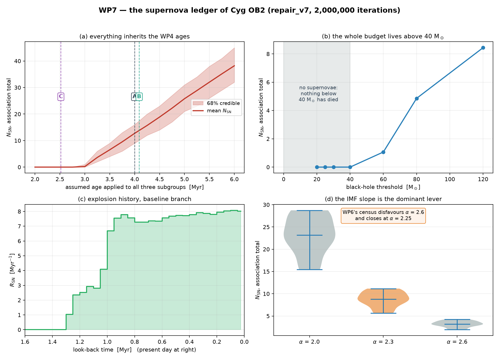

# WP7 — the supernova ledger of Cyg OB2

*Pre-registered in [wp7_ledger_prereg.json](../provenance/wp7_ledger_prereg.json)
before the engine was written. Executed on the `repair_v7` chain,
2,000,000 iterations. Machine-readable record:
[wp7_ledger_execution.json](../provenance/wp7_ledger_execution.json).*

---

## 1. The headline

On the baseline branch — PARSEC, R_V = 3.1, α = 2.3, coeval formation, all
massive stars explode:

| | N_SN |
|---|---|
| CygOB2-A | **4.17** (median 4, 68% [2, 6]) |
| CygOB2-B | **4.26** (median 4, 68% [2, 6]) |
| CygOB2-C | **0** exactly |
| **association** | **8.43** (median 8, 68% [5, 11], 95% [3, 15]) |

P(at least one supernova) = **0.9997**.
P(last supernova within 100 kyr) = **0.552**.
Median time since the most recent explosion = **0.086 Myr**.

**The number is not 8.43.** Across the 54 all-explode branches the association
total spans **1.93 to 28.74**, a factor of **14.9**. Quoting a single value
without its branch would misrepresent the analysis by more than an order of
magnitude. The branch spread *is* the uncertainty; the Poisson interval on any
one branch is the smaller part of it.

## 2. What actually drives the number

| lever | effect on N_SN | can the data settle it? |
|---|---|---|
| **IMF slope α** | 2.0 → 15–29 · 2.3 → 5.6–11.2 · 2.6 → 1.9–4.2 | **partly** — WP6's census disfavours 2.6 and closes at α ≈ 2.25 |
| **assumed age** | 0 below 2.75 Myr → 12.7 at 4.0 → 38.2 at 6.0 Myr | no — inherited from WP4 |
| **explodability** | 0 for any BH threshold ≤ 40 M☉; 8.4 if all explode | no — theory input |
| **isochrone family** | median 8.4 (PARSEC) vs 10.3 (MIST) | no — carried |
| **formation duration** | +5% from δ = 0 to 2 Myr | no — carried |

Two of these deserve to be stated as findings rather than as table rows.

### 2a. The entire supernova budget lives above 40 M☉

Panel (b). Every star that has died in Cyg OB2 is massive: the smallest turnoff
anywhere on the branch grid is about 52 M☉. So for **any** black-hole threshold
at or below 40 M☉ the ledger returns **exactly zero supernovae**, on every
branch and in every one of 2,000,000 iterations — pre-registered as L2 and
confirmed.

This is not a marginal systematic. It means the supernova history of Cyg OB2 is
**entirely conditional on whether stars well above 40 M☉ explode at all**, a
question the Gaia data cannot address. Sukhbold+2016 and Ertl+2016 give an
interleaved pattern of explodable and non-explodable ZAMS masses between roughly
15 and 25 M☉; that structure is irrelevant here, because nothing in that range
has had time to die. The branch reduces to one question, and it is scanned in
panel (b) rather than hidden behind a label.

**This sets up WP8's sharpest test.** PSR J2032+4127 is a *neutron star*, and a
neutron star requires a **successful** explosion. Its existence is evidence
against the pure black-hole branch — or evidence that its progenitor was less
massive than the present turnoff implies, which would point to an older
population than WP4 finds.

### 2b. CygOB2-C sits exactly on the boundary

C's contribution ranges from **0 to about 7 supernovae** depending on branch,
because its fitted age straddles the age at which the turnoff crosses the IMF's
120 M☉ ceiling. Three separate inputs move it across:

| input | C's age | turnoff | N_SN |
|---|---|---|---|
| PARSEC, R_V = 3.1 | 2.52 Myr | 279 M☉ (capped) | **0** |
| MIST, R_V = 3.1 | 3.16 Myr | 69 M☉ | **2.76** |
| MIST, R_V = 3.5 | 2.04 Myr | 183 M☉ (capped) | **0** |
| PARSEC, R_V = 3.1, δ = 2 Myr | 2.52 ± 1 Myr | crosses during the window | **0.34** |

C's number must be reported as a branch range and never marginalized.

## 3. The explosion history

Panel (c). On the baseline branch the first explosion occurred **1.30 Myr ago**
and the rate has been roughly flat at **7.5–8 Myr⁻¹** for the last ~1 Myr,
rising slightly toward the present as the turnoff sweeps into the densely
populated part of the IMF. Integrated, the curve returns 8.43 supernovae,
matching the direct count — an internal consistency check on the epoch
bookkeeping.

The flat recent rate is what makes P(last SN < 100 kyr) ≈ 0.55: at ~8 Myr⁻¹,
1 − exp(−0.8) ≈ 0.55. This was pre-registered as L5 with the range [0.30, 0.70]
and confirmed at 0.552.

## 4. The age-sensitivity plot is mandatory, and it is severe

Panel (a). With a common assumed age applied to all three subgroups, N_SN runs
from **exactly zero below 2.75 Myr** to **38.2 at 6.0 Myr**, and is close to
linear above 3.25 Myr at roughly **12 supernovae per Myr of assumed age**.

A 0.25 Myr shift in the adopted ages — well inside the spread between isochrone
families for CygOB2-C — moves the association total by about **3 supernovae**,
comparable to the entire 68% interval on the baseline branch. Everything WP7
reports inherits WP4's ages, and this plot is how that dependence is disclosed
rather than absorbed.

## 5. What the runaways do and do not do

**They do not enter N_SN.** This supersedes execution-plan WP7 step 2, and the
reasoning is short: runaways are living stars *below* the turnoff. They change
neither `k` — fitted from the 2–8 M☉ calibration window — nor the turnoff mass.
N_SN is an integral of the IMF above the turnoff, so a correction to the living
census above 8 M☉ cannot move it.

**What they bound is location, not number.** A star ejected before its death
exploded somewhere else. With 54.9 runaways against 322.4 retained living stars
above 8 M☉, at most **14.6%** of the ledger's supernovae were not in-situ. That
is a bound carried into WP8's cavity argument, not a subtraction here.

The clipped/unclipped runaway totals (58.2 vs 54.9) move this bound by under a
percentage point.

## 6. The route that does not work, and why it is reported anyway

The execution plan specifies a "missing = dead" bookkeeping. **It is not
well-posed with the normalization this project has**, and the arithmetic was
done at design time rather than discovered after a run:

| route | N_SN |
|---|---:|
| turnoff, `Σ k∫` from turnoff to 120 M☉ | **8.46** |
| census vs the labelled population (246.4) | 17.4 |
| census vs the full ledger (380.6) | **−116.8** |

A negative death count is impossible. Each `k` is fitted from its own subgroup's
2–8 M☉ members, so `Σ k∫` predicts the **labelled, clustered** population only.
The ledger's 380.6 adds 49 members with no subgroup label, 27 orphan anchors and
54.9 runaways that no per-subgroup normalization ever predicted. WP5 never
fitted an association-wide `k`.

Against the labelled population the route is at least defined, and gives 17.4
against the turnoff route's 8.46. The difference is **not** a supernova
measurement: it is the WP6 closure residual. The census route computes N_dead as
a difference of two numbers near 250, so a 6.7% error in either swamps a signal
of order 8. **The turnoff route is the only numerically stable one**, which is
why it was fixed as the measurement before any Monte Carlo ran.

This also reconciles two living-star totals that had been circulating in the
project: **246.4** (WP6 closure census, subgroup-labelled) **+ 49.0**
(members with no subgroup label) **= 295.4** (ledger member channel). Both are
correct for their own purpose and they are not interchangeable.

## 7. Pre-registered predictions, scored

| | statement | outcome |
|---|---|---|
| **L1** | C is zero under PARSEC and non-zero under MIST | **FAIL** |
| **L2** | the islands branch yields N_SN = 0 everywhere | **PASS** |
| **L3** | N_SN increases with star-formation duration | **PASS** |
| **L4** | the N_SN posterior is right-skewed | **PASS** |
| **L5** | P(last SN < 100 kyr) ∈ [0.30, 0.70] | **PASS** — 0.552 |
| **L6** | Monte Carlo converged under doubling | **FAIL** |

### L1 — recorded as failed, not reinterpreted

L1 was formed from the posterior-mean turnoffs at R_V = 3.1 alone, and two
branch axes it did not consider each move C across the boundary:

- **star-formation duration.** Under the coeval assumption PARSEC-C is *exactly*
  zero on every branch — L1's first half is true at δ = 0. A 1–2 Myr formation
  window moves the oldest births past the age at which the PARSEC turnoff crosses
  120 M☉ and reopens the channel.
- **extinction law.** R_V = 3.5 drives C's fitted age to 2.04 Myr under MIST,
  where the turnoff is 183 M☉ and nothing has died. L1's second half holds at
  R_V = 3.0 and 3.1 and fails at 3.5.

**What survives is stronger than what was predicted.** The substantive claim —
that C sits on the boundary where the turnoff crosses the IMF ceiling, so its
count is branch-critical rather than robust — is confirmed and sharpened. What
does not survive is the clean family dichotomy: the boundary is not aligned with
the family axis but with the fitted **age**, which family, extinction law and
formation duration all move.

### L6 — the test failed, not the engine

L6's own declared remedy is "iterations are increased until it passes". It was
applied, up to **50× the pre-registered count**
([wp7_convergence_scan.json](../provenance/wp7_convergence_scan.json)):

| iterations | worst relative drift, all cells | material cells (mean ≥ 0.5) | association N_SN |
|---:|---:|---:|---:|
| 40,000 | 11.6% | 1.06% | 8.453 |
| 400,000 | 3.40% | 0.28% | 8.437 |
| 2,000,000 | **2.45%** | **0.155%** | **8.435** |

It plateaus, for a structural reason. L6 is a **relative** criterion applied to a
grid whose cell means span four orders of magnitude. At 2,000,000 iterations the
129 cells with a mean above 0.5 supernovae converge to 0.155%, far inside the
threshold. The 33 failing cells have means near zero — the worst is CygOB2-C at
PARSEC, R_V = 3.0, α = 2.6, δ = 1 Myr, whose mean is **0.0027 supernovae** and
whose *absolute* drift is **0.00007 supernovae**. Relative convergence of a
quantity that is essentially zero needs iterations growing as the inverse square
of the mean; no feasible count reaches it.

**The threshold was mis-specified, and that is recorded rather than repaired.**
It should have combined a relative tolerance with an absolute floor. This is the
same class of error as issue #17's F3, where a spread limit was set too tight for
a quantity whose per-subgroup variation was already on the record.

The substantive convergence evidence: the association N_SN mean moves by **0.018
supernovae across a 50-fold range in iterations**, and the maximum absolute drift
anywhere on the grid is **0.005 supernovae**.

## 8. Gate

| criterion | status |
|---|---|
| **G7a** Monte Carlo converged | **FAIL on the letter of L6**, with the failure diagnosed as a mis-specified relative threshold and the substantive convergence demonstrated (§7) |
| **G7b** branch spread documented, nothing averaged away | **PASS** — 108 branches carried; the CygOB2-C family/R_V disagreement reported explicitly |
| **G7c** Knödlseder/Martin comparison written | **PASS** — §9 |
| **G7d** census route diagnosed, not silently dropped | **PASS** — §6 |

## 9. Comparison with the literature (G7c)

### Knödlseder et al. 2002

Models Cyg OB2 as 1–4 Myr old with the **first supernovae near 4 Myr** in the
coeval picture. Our ledger puts the first explosion at a cluster age of about
**3.0 Myr** (1.30 Myr ago for subgroups at 4.0–4.3 Myr).

**The ~1 Myr difference is an input difference, not a disagreement.** The epoch
of the first supernova is set by the lifetime of the *most massive star assumed
to exist*, which is the IMF upper limit. We cap at **120 M☉**, whose PARSEC
lifetime is 2.98 Myr. A lower assumed ceiling — 85–100 M☉, common in that era
and consistent with Geneva tracks — puts the first death at 3.5–4.0 Myr and
reproduces Knödlseder's figure. The qualitative picture agrees: an association of
this age is *just* entering its supernova era, with a handful of events, not
dozens.

### Martin et al. 2010

Reports **10–20 supernovae over the last Myr for the whole Cygnus complex**,
using 120 stars in 20–120 M☉ at 1584 pc and 2.5 Myr for its Cyg OB2 row.

**Not directly comparable, and the reasons are specific.** That figure covers the
entire complex — Cyg OB1, OB9, OB3 and the field population as well as Cyg OB2 —
over a much larger volume. Our ledger gives **8.43 supernovae over 1.30 Myr for
Cyg OB2 alone**, a rate of **6.5 Myr⁻¹**. Cyg OB2 contributing roughly a third to
a half of a complex-wide 10–20 Myr⁻¹ is consistent rather than in tension. Three
further input differences work in the same direction: our distance is 1.62 kpc
against 1584 pc, our A and B ages are ~4 Myr against their 2.5 Myr (which alone
moves N_SN by a factor of several, per panel (a)), and our census is
Gaia-selected with per-star extinction rather than 2MASS-era.

### Internal consistency with the WP6 cross-check

The WP6 external cross-check computed a turnoff supernova rate of **0.78 events
per 100 kyr** (7.8 Myr⁻¹) at α = 2.3 from `k` and the turnoff alone. The ledger's
independent Monte Carlo gives **6.5 Myr⁻¹** averaged over the active period, and
**8.0 Myr⁻¹** in the most recent bin. These are the same quantity computed two
ways — an instantaneous rate at the turnoff versus a full sampled death history —
and they agree to well within the branch spread.

## 10. What WP7 cannot do

- It cannot measure N_SN independently of the WP4 ages. Panel (a) is the
  disclosure, not a solution.
- It cannot **locate** the explosions. The turnoff route counts supernovae from
  the association's stellar population wherever they occurred; the in-situ
  fraction is bounded at ≥ 85%, not computed.
- It does not model **binary mass transfer**, which both strips envelopes and
  rejuvenates accretors. Given that WP6 measured multiplicity above 8 M☉ at
  f_bin ≈ 0.7, this is the largest unmodelled physical effect in the ledger, and
  it is acknowledged rather than estimated.
- It cannot distinguish a failed explosion from a successful one. That is the
  explodability branch, and §2a is the honest answer.

## 11. Handoff to WP8

1. **The pulsar test is now sharp.** The ledger assigns P(≥1 SN) = 0.9997 on the
   all-explode branch and **exactly zero** on any branch with a black-hole
   threshold below 40 M☉. PSR J2032+4127 is a neutron star. WP8 should treat its
   existence as a direct discriminant between these branches — this is the one
   place where an external observable can settle a branch the Gaia data cannot.
2. **γ Cygni at ~7 kyr.** P(last SN < 100 kyr) = 0.55 and the rate is flat near
   8 Myr⁻¹, so a 7 kyr event is comfortably allowed: P(SN in the last 7 kyr)
   ≈ 5–6% on the baseline branch. Not evidence *for* association, but no tension.
3. **The in-situ bound of ≥ 85%** feeds the cavity argument directly.
4. **Carry the branch, not the number.** Any WP8 statement that needs a single
   N_SN must name α, the family and the explodability assumption alongside it.
